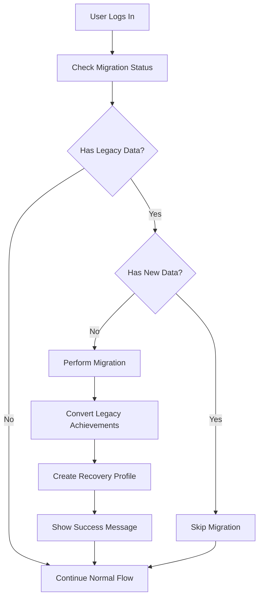

# 🔄 Legacy Data Migration Integration Guide

This guide explains how to integrate the legacy data migration system into your VOLT app to restore users' previous achievements when they log in.

## 🎯 Problem Solved

Users were losing their previous achievements when logging into their accounts because the old achievement data wasn't being migrated to the new AI rehabilitation system. This migration system automatically detects and migrates legacy data when users log in.

## 🚀 Quick Start

### 1. Test the Migration System

First, let's test if the migration system can find your legacy data:

```bash
# Discover what legacy tables exist in your Supabase database
npm run migration:discover

# Test migration for a specific user (replace with actual user ID)
npm run migration:test your-user-id-here

# Force migration for a user (if needed)
npm run migration:force your-user-id-here
```

### 2. Integrate into Your Login Flow

Add the migration hook to your authentication component:

```typescript
import { useAutoMigrationOnLogin } from '../utils/hooks/useMigrationOnLogin';

// In your login/auth component
const YourAuthComponent = () => {
  const [currentUser, setCurrentUser] = useState(null);
  
  // This will automatically trigger migration when user logs in
  const { migrationResult, isLoading, error } = useAutoMigrationOnLogin(currentUser?.id);

  // Show migration success message
  useEffect(() => {
    if (migrationResult?.migrationPerformed && migrationResult.migrationResult?.success) {
      Alert.alert(
        '🎉 Welcome Back!', 
        migrationResult.message,
        [{ text: 'Great!', style: 'default' }]
      );
    }
  }, [migrationResult]);

  // Your existing login logic...
  const handleLogin = async (email, password) => {
    const { user } = await supabase.signIn(email, password);
    setCurrentUser(user); // This will trigger the migration
  };

  return (
    // Your login UI...
    // Migration happens automatically in the background
  );
};
```

### 3. Manual Migration Trigger (Optional)

If you want to provide a manual "Sync Data" button:

```typescript
import { useMigrationOnLogin } from '../utils/hooks/useMigrationOnLogin';

const ProfileScreen = () => {
  const { triggerMigration, migrationResult, isLoading } = useMigrationOnLogin();
  
  const handleSyncData = async () => {
    await triggerMigration(currentUser.id);
  };

  return (
    <View>
      <TouchableOpacity onPress={handleSyncData} disabled={isLoading}>
        <Text>{isLoading ? 'Syncing...' : '🔄 Sync Previous Data'}</Text>
      </TouchableOpacity>
      
      {migrationResult?.migrationPerformed && (
        <Text>✅ Restored {migrationResult.migrationResult?.achievementsMigrated} achievements!</Text>
      )}
    </View>
  );
};
```

## 🧪 Testing & Debugging

### Use the Migration Test Component

Add the test component to your app for debugging:

```typescript
import { MigrationTestComponent } from '../components/MigrationTestComponent';

// Add this to a debug screen or development menu
<MigrationTestComponent currentUserId={user?.id} />
```

### Command Line Testing

```bash
# Build the project first
npm run build

# Discover legacy tables
npm run migration:discover

# Test with your actual user ID
npm run migration:test "abc123-def456-ghi789"

# Force migration if needed
npm run migration:force "abc123-def456-ghi789"
```

## 🔧 How It Works

### 1. **Automatic Discovery**
The system automatically discovers existing tables in your Supabase database that might contain legacy achievement data.

### 2. **Smart Migration**
- Detects common table structures for achievements/milestones
- Maps legacy data to the new AI rehabilitation system format
- Prevents duplicate migrations
- Handles various column naming conventions

### 3. **Seamless Integration**
- Runs automatically when users log in
- Shows success messages to users
- Preserves all existing achievement data
- Creates recovery profiles if missing

## 📊 Migration Process



## 🗂️ Supported Legacy Table Structures

The migration system automatically detects and handles various table structures:

### Achievements Tables
- `achievements`, `user_achievements`, `milestones`, `user_milestones`
- Columns: `user_id`, `achievement_type`, `achievement_name`, `description`, `earned_date`, `milestone_value`

### Profile Tables  
- `profiles`, `user_profiles`, `recovery_data`, `progress`, `user_progress`
- Columns: `user_id`, `recovery_start_date`, `total_recovery_days`, `days_since_last_setback`, `current_stage`

## ⚙️ Configuration

### Environment Variables
Make sure your `.env` file has the correct Supabase configuration:

```env
SUPABASE_URL=https://uikrxtokvqelmndkinuc.supabase.co
SUPABASE_ANON_KEY=your-actual-anon-key-here
```

### Database Permissions
Ensure your Supabase RLS policies allow reading from legacy tables and writing to new tables.

## 🚨 Troubleshooting

### Common Issues

1. **"No tables found"**
   - Check your Supabase connection
   - Verify the anon key has read permissions
   - Run `npm run migration:discover` to see what tables exist

2. **"Migration failed"**
   - Check the console logs for specific errors
   - Verify user ID format matches your database
   - Ensure new tables exist (run the migration SQL script)

3. **"Duplicate data"**
   - The system prevents duplicates automatically
   - Use force migration only if needed
   - Check if user already has new system data

### Debug Mode

Enable detailed logging by setting:
```env
NODE_ENV=development
```

### Manual Database Check

You can manually check your Supabase database:
1. Go to https://supabase.com/dashboard/project/uikrxtokvqelmndkinuc/editor
2. Look for tables containing user achievement data
3. Note the table names and column structures

## 📈 Success Metrics

After integration, you should see:
- ✅ Users retain their previous achievements when logging in
- ✅ Automatic migration messages appear for returning users
- ✅ No duplicate data in the new system
- ✅ Smooth transition to AI-powered features

## 🔄 Next Steps

1. **Test with Real Users**: Use actual user IDs from your database
2. **Monitor Migration Logs**: Check for any errors or edge cases
3. **User Communication**: Consider notifying users about the data migration
4. **Backup Strategy**: Ensure legacy data remains intact during migration

## 📞 Support

If you encounter issues:
1. Check the console logs for detailed error messages
2. Use the migration test component for debugging
3. Verify your Supabase configuration and permissions
4. Test with the command line tools first

The migration system is designed to be safe and non-destructive - it only reads from legacy tables and creates new data, never modifying or deleting existing information.